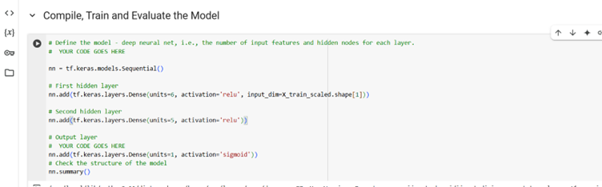
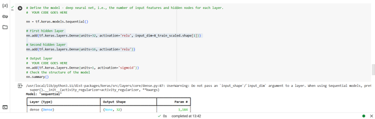
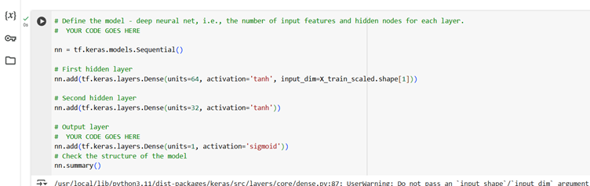
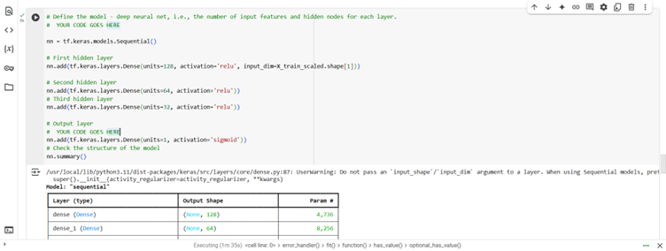
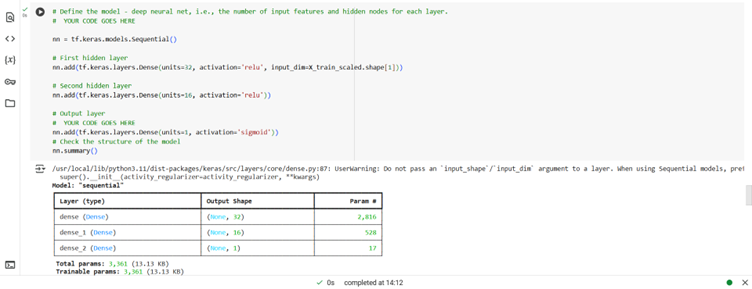
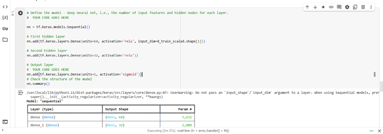

# Deep Learning Challenge: Alphabet Soup Charity Funding Success Prediction

## Overview of the Analysis
The goal of this analysis is to develop a binary classification model predicting the success of organizations funded by Alphabet Soup. The model uses several features, such as application type, organization classification, income, funding amount requested, etc., to predict whether an organization will be successful (`IS_SUCCESSFUL`). The objective is to apply machine learning techniques to fine-tune the model and enhance its performance.

---

## Results
### Data Preprocessing:
- **Target Variable(s):** The target variable for this model is `IS_SUCCESSFUL`, which indicates whether the funding was used effectively (1 for success, 0 for failure).
- **Feature Variables:** We dropped `EIN` and `NAME` columns for being identification columns and used the remaining relevant features for prediction:
  - `APPLICATION_TYPE`
  - `AFFILIATION`
  - `CLASSIFICATION`
  - `USE_CASE`
  - `ORGANIZATION`
  - `STATUS`
  - `INCOME_AMT`
  - `SPECIAL_CONSIDERATIONS`
  - `ASK_AMT`
- **Unique Values in Columns:** Categorical variables with rare categories were grouped under the value `Other`, reducing complexity.
- **Data Encoding:** Categorical variables were encoded using `pd.get_dummies()` to make the data suitable for model training.
- **Data Splitting:** The data was split into features (`X`) and target (`y`), and further divided into training and testing datasets using `train_test_split()`.
- **Scaling Data:** `StandardScaler` was used to normalize the features.

---

## Model Architecture and Evaluation
### First Attempt:
- **Initial Model Configuration:** Started with a simple architecture consisting of two hidden layers with ReLU activation functions.
- **Evaluation Result:**  
  - Loss: 0.5583  
  - Accuracy: 71.91%
  - Below the target accuracy of 75%.

### Second Attempt:
- **Model Configuration:** Increased the number of units in each layer.
- **Evaluation Result:**
  - Loss: 0.5586
  - Accuracy: 72.38%
    

### Third Attempt:
- **Model Configuration:** Increased units further and changed activation function to `tanh`.
- **Evaluation Result:**
  - Loss: 0.5608
  - Accuracy: 72.45%
    

### Fourth Attempt:
- **Model Configuration:** Added a third hidden layer with increased units.
- **Evaluation Result:**
  - Loss: 0.5750
  - Accuracy: 72.78%
    

### Keras Tuner Experiment:
- **Hyperparameter tuning with Keras Tuner** resulted in an accuracy of only **72%**, suggesting further manual tuning was necessary.

## Optimization Attempts
### Optimization Attempt 1:
- **Model Configuration:** Incorporated the `NAME` column as a feature by using its count.
- **Evaluation Result:**
  - Loss: 0.4930
  - Accuracy: **75.52%**
  - Exceeded the target accuracy of 75%.
    

### Optimization Attempt 2:
- **Model Configuration:** Adjusted the `NAME` count threshold to 100.
- **Evaluation Result:**
  - Loss: 0.5057
  - Accuracy: 74.88%
  - Reduced accuracy; reverted threshold to 50.

### Optimization Attempt 3:
- **Model Configuration:** Increased the number of units in hidden layers while keeping the `NAME` count threshold at 50.
- **Evaluation Result:**
  - Loss: 0.4995
  - Accuracy: **75.54%**
  - Confirmed that the `NAME` feature contributed positively.

---

## Summary and Recommendations
The final optimized model achieved an accuracy of **75.54%**, surpassing the target. The inclusion of the `NAME` count feature significantly improved performance. The best results came from a model with **two hidden layers, increased units, and refined features**.

### Further Optimization Recommendations:
- Implement additional **feature engineering** or data transformations.
- Experiment with **alternative models** (e.g., Random Forest Classifier) for comparison.
- Utilize **hyperparameter tuning** with Keras Tuner for further improvements.

The deep learning model successfully predicts the success of Alphabet Soup-funded organizations and meets the desired accuracy goal.
